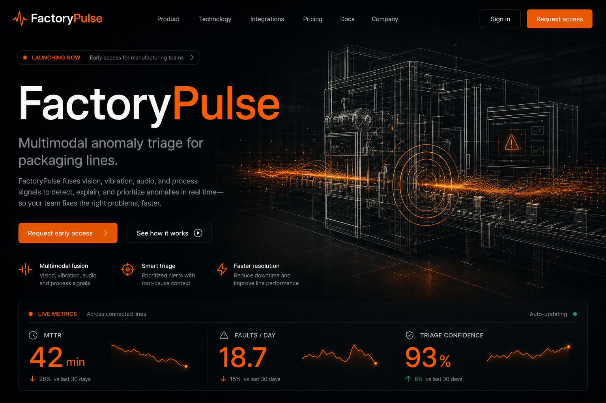
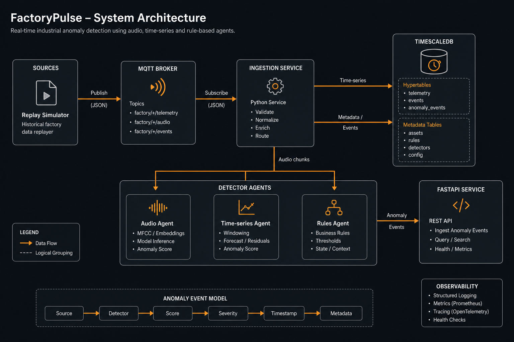
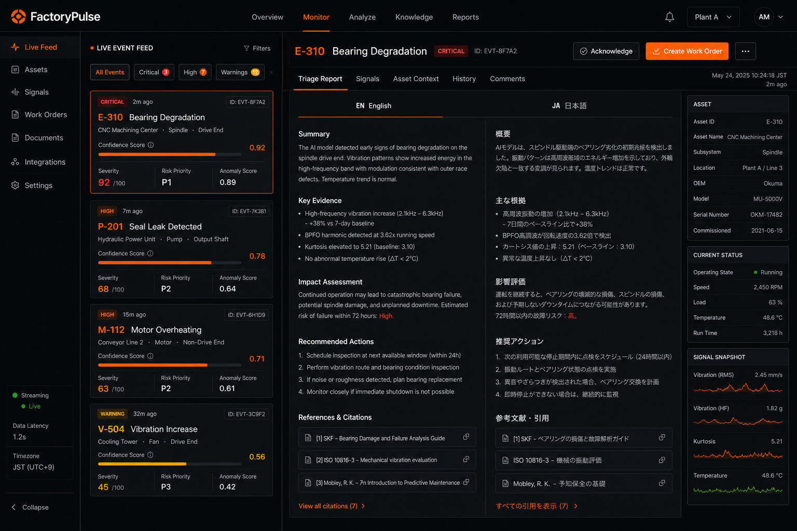
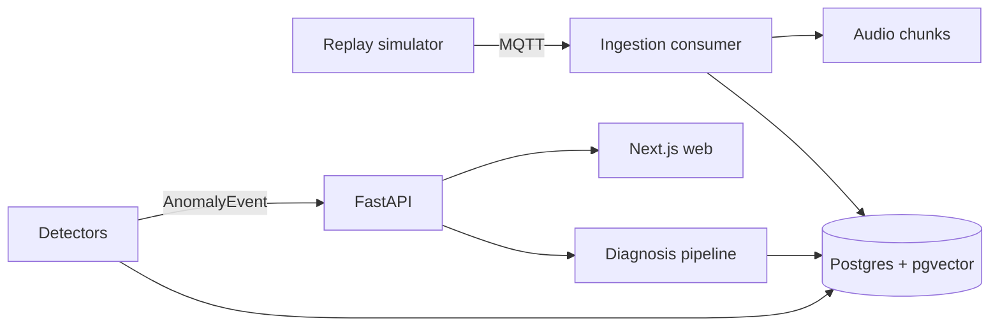

# FactoryPulse

Multimodal anomaly triage copilot for manufacturing packaging lines.

FactoryPulse watches a simulated form-fill-seal line the way a strong maintenance engineer would: it listens to machine audio, tracks sensor time series, applies hard threshold rules, then digs through equipment manuals and past incidents to explain what broke and what to do next. The output is a cited bilingual triage report (English + Japanese) with confidence, recommended action, and downtime risk so operators are not stuck correlating alarms by hand for 30+ minutes.

> Status: **M2** verified on GitHub Actions (RAG + diagnosis + Next.js). Smoke eval gate included. Langfuse remains optional.

## Live website

**https://h3xobit.github.io/factorypulse/**

Public showcase UI (landing, console, evals). The console runs in showcase mode when the FastAPI backend is not hosted; clone the repo and run `make demo` for the full live stack.

## What it is

A production-shaped system for **anomaly detection + root-cause triage** on packaging equipment (VFFS packager, industrial fan, centrifugal pump).

It is built for:
- line operators who need a fast first diagnosis
- maintenance engineers who need citations back to manuals and prior incidents

It is **not** a slide-deck demo. The MQTT simulator, Postgres/pgvector store, detectors, diagnosis pipeline, API, web console, and eval harness are wired together and exercised in CI.

## What it does

1. **Replays line telemetry** over MQTT (sensors + short WAV chunks), with injectable faults:
   - `bearing_degradation`
   - `abnormal_pump_audio`
   - `seal_temp_drift`
2. **Ingests** samples into Postgres and audio files on disk.
3. **Detects anomalies** with three agents:
   - audio classifier (log-mel + gradient boosting)
   - time-series residual scoring
   - static threshold rules from `config/thresholds.yaml`
4. **Diagnoses** via hybrid RAG (exact fault-code match + vector search) over synthetic manuals and historical incidents.
5. **Writes a triage report** in English, translates to Japanese while preserving fault codes and part numbers, and stores the report for the UI.
6. **Serves a dark industrial web app**:
   - `/` product landing
   - `/app` live event console + EN/JA report viewer
   - `/evals` public metrics dashboard
7. **Evaluates itself** on a held-out golden set (diagnosis accuracy, retrieval P@5, hallucination rate, latency).

## Preview







## Architecture



End-to-end path in plain language:

`simulate / inject fault -> MQTT -> ingest -> detect AnomalyEvent -> diagnose with manuals/incidents -> bilingual report -> /app console`

## Quickstart (free machine / CI only)

Host ports stay high on purpose so they do not collide with common local stacks:

| Service | Host port |
| --- | --- |
| Web UI | 13000 |
| API | 18000 |
| Postgres | 15432 |
| MQTT | 11883 |

```bash
cp .env.example .env
make setup
make demo
```

Then open:
- UI: `http://localhost:13000/app`
- API docs: `http://localhost:18000/docs`

In the console: inject a fault, click the event, read the EN/JA triage report.

### Unit tests

```bash
make test
```

### Evals

```bash
make up
make eval
```

## Datasets

- Synthetic manuals and incidents ship in `data/` (enough for demos and smoke evals).
- Optional Kaggle IMS bearings: `python data/download_datasets.py --bearing` (needs Kaggle creds). Large archives are gitignored; delete local downloads after use.

## Eval results

Populated by `make eval` into `evals/results/` and mirrored to `web/public/evals/latest.json`.

| Metric | Gate |
| --- | --- |
| Diagnosis accuracy | >= 0.70 |
| Hallucination rate | <= 0.05 |

CI runs unit tests, a Next.js build, compose demo (inject + diagnose), and a 10-case smoke eval.

## Why this project is interesting

- Multimodal detection instead of a single threshold alarm
- Hybrid retrieval that forces exact fault-code hits, not only fuzzy embeddings
- Verify step that checks unsupported claims before the report is finalized
- Bilingual operator output without mangling codes/part numbers
- Eval gates treated as a product feature, not an afterthought

## License

MIT
